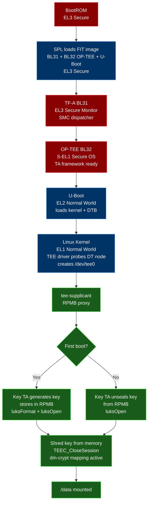

# OP-TEE Boot Flow: ARM TrustZone to Encrypted Partition Mount

## Simplified Overview

```mermaid
flowchart TD
    A["BootROM<br/>EL3 Secure"] --> B
    B["SPL loads FIT image<br/>BL31 + BL32 OP-TEE + U-Boot<br/>EL3 Secure"] --> C
    C["TF-A BL31<br/>EL3 Secure Monitor<br/>SMC dispatcher"] --> D
    D["OP-TEE BL32<br/>S-EL1 Secure OS<br/>TA framework ready"] --> E
    E["U-Boot<br/>EL2 Normal World<br/>loads kernel + DTB"] --> F
    F["Linux Kernel<br/>EL1 Normal World<br/>TEE driver probes DT node<br/>creates /dev/tee0"] --> G
    G["tee-supplicant<br/>RPMB proxy"] --> H
    H{"First boot?"} -- Yes --> I["Key TA generates key<br/>stores in RPMB<br/>luksFormat + luksOpen"]
    H -- No --> J["Key TA unseals key<br/>from RPMB<br/>luksOpen"]
    I --> K["Shred key from memory<br/>TEEC_CloseSession<br/>dm-crypt mapping active"]
    J --> K
    K --> L["/data mounted"]

    classDef secure fill:#8B0000,color:#fff,stroke:#ff4444
    classDef normal fill:#003366,color:#fff,stroke:#4499ff
    classDef user fill:#1a5c1a,color:#fff,stroke:#44ff44

    class A,C,D secure
    class B,E,F normal
    class G,H,I,J,K,L user
```

---

## Detailed Flow

```mermaid
flowchart TD
    subgraph ROM["BootROM - EL3 Secure"]
        A["BootROM<br/>verifies SPL signature"]
    end

    subgraph SPL["SPL - U-Boot Secondary Program Loader - EL3 Secure"]
        B["SPL loads FIT image<br/>from eMMC / SD"]
        B --> B1["FIT image contains:<br/>BL31 arm-trusted-firmware<br/>BL32 OP-TEE tee.bin<br/>U-Boot proper"]
    end

    subgraph TFA["TF-A BL31 - ARM Trusted Firmware - EL3 Secure Monitor"]
        C["BL31 initialises<br/>EL3 Secure Monitor"]
        C --> C1["Registers PSCI and SMC<br/>dispatch table"]
        C1 --> C2["Hands off to BL32<br/>OP-TEE via OPTEE SPD"]
    end

    subgraph OPTEE_BOOT["OP-TEE BL32 Boot - S-EL1 Secure OS"]
        D["OP-TEE initialises<br/>Secure World OS"]
        D --> D1["Sets up Secure Memory<br/>TZASC / TZMA regions"]
        D1 --> D2["TA framework and crypto<br/>primitives ready<br/>TAs loaded on demand"]
        D2 --> D3["Returns to BL31<br/>BL31 jumps to U-Boot"]
    end

    subgraph UBOOT["U-Boot - EL2 Normal World"]
        E["U-Boot initialises<br/>env / MMC / DRAM"]
        E --> E4["Load kernel + DTB<br/>from boot partition"]
        E4 --> E5["DTB includes firmware node:<br/>compatible = linaro,optee-tz"]
        E5 --> E6["bootm - hands to kernel<br/>EL1 Normal World"]
    end

    subgraph KERNEL["Linux Kernel Boot - EL1 Normal World"]
        F["Kernel registers<br/>TEE subsystem"]
        F --> F1["OP-TEE driver probes<br/>DT node linaro,optee-tz<br/>method = smc"]
        F1 --> F2["Creates<br/>/dev/tee0<br/>/dev/teepriv0"]
        F2 --> F3["dm-crypt / fscrypt<br/>subsystem ready"]
        F3 --> F4["Kernel mounts rootfs"]
    end

    subgraph USERSPACE["Userspace - EL0 Normal World"]
        G["systemd starts"]
        G --> G1["tee-supplicant starts<br/>reverse-RPC proxy on /dev/teepriv0<br/>handles RPMB and FS I/O<br/>on behalf of TAs in S-EL0"]
        G1 --> G2["Key management app<br/>opens TA session via libteec<br/>TEEC_OpenSession on /dev/tee0"]
        G2 --> G3{"First boot?<br/>persistent object exists?"}

        G3 -- "No - first boot" --> G4["Key TA generates new key<br/>TEE_GenerateKey in secure world"]
        G4 --> G5["Key TA stores key<br/>TEE_CreatePersistentObject<br/>RPC to tee-supplicant RPMB backend"]
        G5 --> G6["cryptsetup luksFormat<br/>create LUKS partition on /data"]
        G6 --> G7["cryptsetup luksOpen<br/>with new key"]

        G3 -- "Yes - normal boot" --> G8["Key TA loads existing key<br/>TEE_OpenPersistentObject<br/>RPC to tee-supplicant RPMB backend"]
        G8 --> G9["Key returned to app<br/>via TEE shared memory"]
        G9 --> G10["cryptsetup luksOpen<br/>with unsealed key"]

        G7 --> G11["Shred key from memory<br/>TEEC_CloseSession<br/>dm-crypt mapping active"]
        G10 --> G11
        G11 --> G12["Mount /data"]
    end

    A --> B
    B1 --> C
    C2 --> D
    D3 --> E
    E6 --> F
    F4 --> G

    classDef secure fill:#8B0000,color:#fff,stroke:#ff4444
    classDef el3 fill:#B8860B,color:#fff,stroke:#FFD700
    classDef normalworld fill:#003366,color:#fff,stroke:#4499ff
    classDef userspace fill:#1a5c1a,color:#fff,stroke:#44ff44

    class ROM,TFA,OPTEE_BOOT secure
    class SPL el3
    class UBOOT,KERNEL normalworld
    class USERSPACE userspace
```
